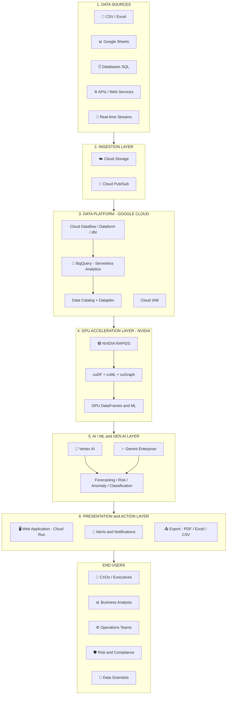
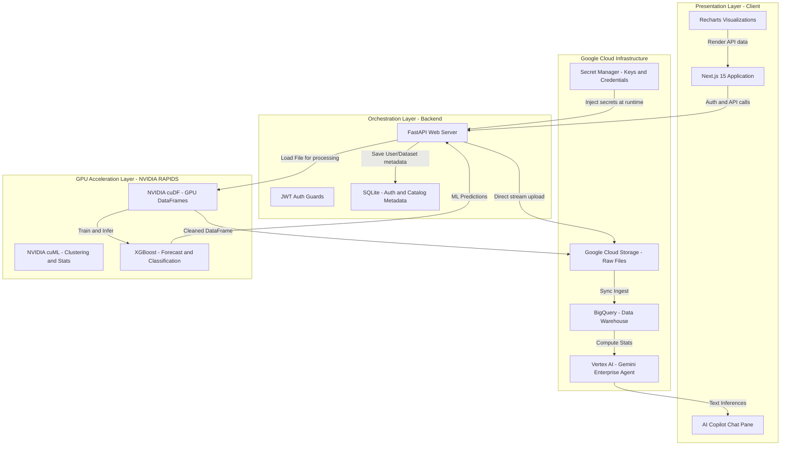
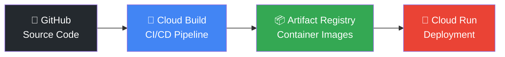

# 🏗️ System Architecture Guide — InsightIQ AI

**Google Cloud** &nbsp;×&nbsp; **Gen AI Academy** `APAC Edition` &nbsp;×&nbsp; **NVIDIA**

### InsightIQ AI — Accelerated Decision Intelligence Platform
*Scalable • Secure • AI-Powered • GPU Accelerated • Cloud-Native*

---

## 📐 High-Level Architecture

---

## 🔗 Component Interaction Diagram

---

## 📂 Component Specifications

### Layer 1 — Data Sources
| Source Type | Format | Ingestion Method |
|-------------|--------|-----------------|
| CSV / Excel | `.csv`, `.xlsx` | Next.js File Upload → FastAPI Multipart |
| Google Sheets | API | OAuth2 Connector (UI ready) |
| Databases (SQL) | SQL queries | API Webhook Connector (UI ready) |
| APIs / Web Services | JSON | REST API Ingestion |

---

### Layer 2 — Ingestion Layer
| Technology | Purpose |
|------------|---------|
| **Cloud Storage (GCS)** | Raw file storage — all uploaded datasets land here first |
| **FastAPI Multipart** | Files parsed locally for structure validation, then streamed to GCS |
| **BigQuery Load Jobs** | Structured data auto-loaded from GCS into BigQuery schemas |

**Mechanism**: Files are validated client-side (format, size), uploaded via multipart POST to FastAPI, saved to GCS bucket, and then loaded into BigQuery with auto-detected schemas.

---

### Layer 3 — Data Platform (Google Cloud)

| Service | Role |
|---------|------|
| **BigQuery** | Serverless data warehouse — stores all analytical data |
| **Data Catalog** | Metadata management and governance |
| **Cloud IAM** | Fine-grained access control and permissions |
| **Secret Manager** | Secure storage for API keys and JWT secrets |

---

### Layer 4 — GPU Acceleration Layer (NVIDIA)

| Component | Purpose | Speedup |
|-----------|---------|---------|
| **cuDF** | GPU-accelerated DataFrames (drop-in pandas replacement) | 10x–15x |
| **cuML** | GPU-accelerated machine learning (clustering, stats) | 5x–8x |
| **cuGraph** | GPU-accelerated graph analytics | 10x+ |

**Mechanism**: Data cleaning operations (median imputation, duplicate removal, sorting, groupby aggregation) are parallelized across thousands of CUDA cores via cuDF. The system benchmarks CPU vs GPU execution and displays the acceleration factor in real-time.

**Accelerated Workloads**:
- ✅ Large Scale Data Processing
- ✅ Feature Engineering
- ✅ ML Training & Inference
- ✅ Fraud & Anomaly Detection
- ✅ Time Series Forecasting

---

### Layer 5 — AI / ML & Gen AI Layer

| Model | Algorithm | Purpose |
|-------|-----------|---------|
| **Revenue Forecasting** | XGBoost Regressor | Predicts daily revenue using 7-day and 14-day lag features |
| **Fraud Detection** | XGBoost Classifier | Identifies high-risk anomalous transactions based on value and category |
| **Customer Segmentation** | K-Means Clustering | Groups clients into 4 quadrants (Strategic, Growing, Risky, Stable) |
| **AI Copilot** | Gemini Enterprise Agent | Natural language insights from dataset statistics and anomalies |

**Gemini Integration**: Summarized dataset metrics and detected anomalies are appended as structured prompt context. Gemini generates executive-level findings and actionable recommendations in markdown format.

---

### Layer 6 — Presentation & Action Layer

| Component | Technology | Function |
|-----------|-----------|----------|
| **Web Application** | Next.js on Cloud Run | Interactive dashboards, real-time insights |
| **Alerts System** | FastAPI + WebSocket | Real-time risk notifications with severity levels |
| **Report Generator** | PDF / Excel / CSV | Scheduled and on-demand report exports |
| **AI Copilot UI** | React Chat Component | Natural language Q&A with Gemini |

---

## 🔐 Cross-Cutting Services (Google Cloud)

| Service | Icon | Purpose |
|---------|------|---------|
| **Cloud Run** | ☁️ | Application Hosting (Serverless Compute) |
| **Cloud Build** | 🔨 | CI/CD Pipeline (Container Image Builds) |
| **Secret Manager** | 🔒 | Secrets & API Keys (JWT, Gemini API Key) |
| **Cloud Logging** | 📝 | Application Logs & Error Tracking |
| **Cloud Monitoring** | 📈 | Metrics, Alerts & Performance Monitoring |
| **Cloud IAM** | 🛡️ | Access Control & Role-Based Permissions |
| **Artifact Registry** | 📦 | Docker Container Image Storage |

---

## 🔧 DevOps & Infrastructure Pipeline

| Step | Service | Action |
|------|---------|--------|
| 1 | **GitHub** | Push code changes to `main` branch |
| 2 | **Cloud Build** | Automatically builds Docker images from Dockerfiles |
| 3 | **Artifact Registry** | Stores versioned container images (`gcr.io/[PROJECT_ID]/...`) |
| 4 | **Cloud Run** | Deploys new revision, routes 100% traffic to latest |

---

## 🌊 Data Flow Legend

| Arrow Style | Meaning |
|-------------|---------|
| ──────→ | Data Flow |
| ─ ─ ─ → | Control / Orchestration |
| · · · · → | User Interaction |
| ═══════→ | Secure & Monitored |

---

## 🏆 Key Highlights

| # | Highlight |
|---|-----------|
| ✅ | End-to-End Data to Decision Architecture |
| ✅ | GPU Accelerated Analytics with NVIDIA RAPIDS (10x–15x speedup) |
| ✅ | AI-Powered Insights using Vertex AI & Gemini Enterprise |
| ✅ | Scalable, Secure & Cloud-Native on Google Cloud |
| ✅ | Real-time Dashboards, Alerts & Actionable Recommendations |
| ✅ | 8 Fully Functional Production Screens |

---

**InsightIQ AI** — *From Raw Data to Better Decisions in Seconds* 🚀

Built with ❤️ for **Google Cloud × NVIDIA Gen AI Academy APAC Edition**

