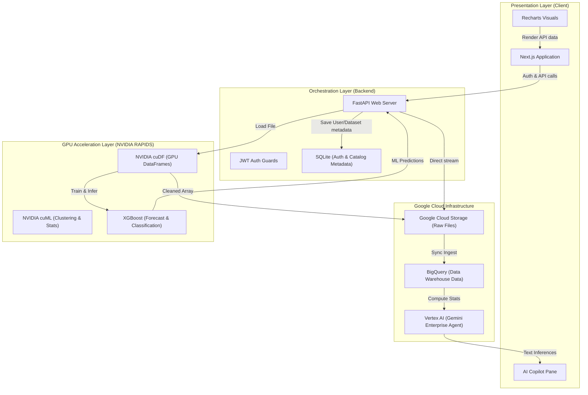

# System Architecture Guide - InsightIQ AI

This document maps out the system architecture, component relationships, and data workflows of the **InsightIQ AI Decision Intelligence Platform**.

---

## 🗺️ Architectural Diagram

---

## 📂 Component Specifications

### 1. Ingestion Layer
* **Technology**: Next.js custom dropzone -> FastAPI Multipart payload.
* **Mechanism**: Files are parsed locally to check structure (.csv, .xlsx, .json). Valid payloads are saved temporarily, uploaded to GCS, and loaded into BigQuery.

### 2. GPU Acceleration Layer
* **Technology**: NVIDIA RAPIDS (cuDF / cuML), CUDA cores.
* **Mechanism**: Instead of heavy CPU threads, cleaning logic (median imputation, drop duplicates, and sorting) is parallelized on GPU threads via cuDF. The system compares execution speeds and highlights the acceleration factor on the benchmark page.

### 3. Machine Learning Layer
* **Models**:
  * **Recursive Forecasting**: XGBoost Regressor predicts daily revenue using 7-day and 14-day lags.
  * **Fraud Detection**: XGBoost Classifier identifies high-risk anomalous transactions based on transaction value and categorical variables.
  * **Customer Segmentation**: K-Means clustering groups clients into 4 distinct quadrants (e.g. Strategic, Risky).

### 4. AI Insight Copilot Layer
* **Technology**: Vertex AI Gemini API.
* **Mechanism**: Summarized dataset details and anomalies are appended as prompt context. Gemini structures key findings and outputs recommendations.
