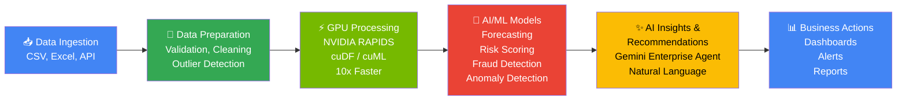
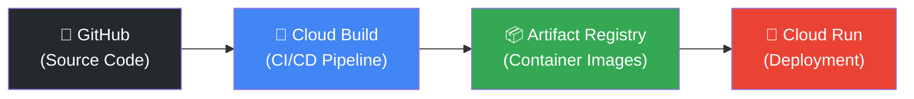

# 🚀 InsightIQ AI — Deployment & Architecture Guide

<div align="center">

**Google Cloud** &nbsp;×&nbsp; **Gen AI Academy** `APAC Edition` &nbsp;×&nbsp; **NVIDIA**

### InsightIQ AI — Accelerated Decision Intelligence Platform
*Scalable • Secure • AI-Powered • GPU Accelerated • Cloud-Native*

</div>

---

## 📡 Live Production URLs

| Service | URL | Platform |
|---------|-----|----------|
| 🌐 **Frontend (Next.js)** | [https://insightiq-frontend-1018473658663.us-central1.run.app](https://insightiq-frontend-1018473658663.us-central1.run.app) | Google Cloud Run |
| ⚙️ **Backend API (FastAPI)** | [https://insightiq-backend-1018473658663.us-central1.run.app](https://insightiq-backend-1018473658663.us-central1.run.app) | Google Cloud Run |
| 📊 **BigQuery Dataset** | `skilled-chalice-497112-g3.insightiq_analytics` | BigQuery |
| 🪣 **Cloud Storage Bucket** | `gs://skilled-chalice-497112-g3-datasets` | GCS |

> **Default Login**: `analyst@insightiq.ai` / `password123`

---

## 🏗️ Architecture Diagram

```mermaid
graph LR
    subgraph Sources ["1. DATA SOURCES"]
        CSV["📄 CSV / Excel"]
        Sheets["📊 Google Sheets"]
        SQL["🗄️ Databases (SQL)"]
        APIs["🌐 APIs / Web Services"]
        Streams["📡 Real-time Streams"]
    end

    subgraph Ingestion ["2. INGESTION LAYER"]
        GCS["☁️ Cloud Storage"]
        PubSub["📨 Cloud Pub/Sub"]
    end

    subgraph DataPlatform ["3. DATA PLATFORM (GOOGLE CLOUD)"]
        Dataflow["Cloud Dataflow"]
        Dataform["Dataform / dbt"]
        BQ["🏢 BigQuery\n(Serverless Analytics)"]
        Catalog["Data Catalog"]
        Dataplex["Dataplex"]
        IAM["Cloud IAM"]
    end

    subgraph GPU ["4. GPU ACCELERATION LAYER (NVIDIA)"]
        RAPIDS["🟢 NVIDIA RAPIDS\ncuDF + cuML + cuGraph"]
        Accel["✅ Large Scale Processing\n✅ Feature Engineering\n✅ ML Training & Inference\n✅ Fraud & Anomaly Detection\n✅ Time Series Forecasting"]
    end

    subgraph AIML ["5. AI / ML & GEN AI LAYER"]
        VertexAI["🤖 Vertex AI\n(Training, Tuning, Deployment)"]
        Gemini["✨ Gemini Enterprise\n(AI Copilot & Insights)"]
        Models["• Forecasting Models\n• Risk Scoring Models\n• Anomaly Detection\n• Classification / Regression"]
    end

    subgraph Presentation ["6. PRESENTATION & ACTION LAYER"]
        WebApp["🖥️ Web Application\n(Cloud Run)\nReal-time Insights"]
        Alerts["🔔 Alerts & Notifications"]
        Export["📤 Export & Sharing\nPDF / Excel / CSV"]
    end

    subgraph Users ["END USERS"]
        CXO["👔 CXOs / Executives"]
        Analysts["📊 Business Analysts"]
        Ops["⚙️ Operations Teams"]
        Risk["🛡️ Risk & Compliance"]
        DS["🔬 Data Scientists"]
    end

    Sources --> Ingestion
    Ingestion --> DataPlatform
    DataPlatform --> GPU
    GPU --> AIML
    AIML --> Presentation
    Presentation --> Users
```



---

## 🔄 Process Flow / Use-Case Diagram



### Use Cases

| Industry | Application |
|----------|------------|
| 🏦 Banking & Finance | Fraud detection, risk scoring, transaction anomalies |
| 🛒 Retail & E-commerce | Customer segmentation, demand forecasting, revenue analysis |
| 🏭 Manufacturing | Supply chain optimization, quality control analytics |
| 🏥 Healthcare | Patient data analysis, operational efficiency |
| 🏛️ Government | Public data analysis, compliance monitoring |
| 🚀 MSMEs & Startups | Business intelligence, growth forecasting |

### Benefits

| Benefit | Description |
|---------|-------------|
| ⚡ Faster Time-to-Insight | Seconds instead of hours for data analysis |
| 🟢 10X+ Performance | GPU acceleration with NVIDIA RAPIDS |
| 🤖 Better Decisions | AI-powered insights via Gemini Enterprise |
| 📉 Reduced Manual Effort | Automated data cleaning, analysis, and reporting |
| 🔔 Real-time Alerts | Proactive notifications for anomalies and risks |
| ☁️ Scalable & Secure | Cloud-native on Google Cloud Platform |

---

## 🖥️ Platform Features (8 Screens)

### 1. Login / Welcome Screen
- Secure JWT-based authentication
- Pre-seeded analyst credentials for demo
- "Continue with Google" OAuth option (UI ready)

### 2. Data Upload & Ingestion
- Drag-and-drop file upload (CSV, Excel, JSON, Parquet)
- Integration connectors: Google Sheets, BigQuery, Cloud Storage, SQL Database, API Webhook
- Automatic schema detection and preview

### 3. Executive Dashboard (Overview)
- **KPI Cards**: Total Revenue (₹126.8 Cr), Net Profit (₹22.4 Cr), Risk Score (28/100), Growth Rate (12.6%)
- RAPIDS Speedup indicator (11.4x)
- Revenue Over Time chart (interactive)
- Top Performing Products table
- Sales by Region breakdown
- Alerts Summary panel

### 4. Data Analytics & Exploration
- **NVIDIA RAPIDS GPU Benchmark Suite**
- CPU vs GPU side-by-side execution comparison
- Correlation Heatmaps, Category Analysis, Distribution charts
- Trend Analysis with pivot tables
- Top Customers ranking

### 5. AI Insights (Gemini Copilot)
- Natural language chat interface powered by **Gemini Enterprise Agent**
- Connected to BigQuery Intelligence Catalog
- Quick-ask suggestion buttons
- Executive Fraud Risk Analysis reports
- Download Executive Report as PDF

### 6. Forecasting & Predictions
- **Machine Learning Modeling Studio**
- Revenue forecasting with XGBoost / Prophet models
- Configurable forecast horizons (Monthly, Quarterly, Yearly)
- Confidence score display (92%)
- Forecast Summary table with Growth %
- Key Drivers analysis (Seasonal Demand, Marketing Campaigns, Product Launch)

### 7. Alerts & Notifications
- Real-time decision alerts with severity levels
- Filterable by: All, High Risk, Anomaly, Inventory, System
- Alert cards with "Resolve" actions
- Alert types: High-Risk Customer, Anomaly Detected, Inventory Low, Unusual Transaction

### 8. Reports & Export
- Intelligence Report Center
- Generated reports: Executive Summary, Sales Performance, Risk Analysis, Forecast, Customer Insights
- Schedule Automatic Reports
- Export formats: PDF, Excel, CSV

---

## 🛠️ Technology Stack

```
┌─────────────────────────────────────────────────────────────────────┐
│  FRONTEND                                                           │
│  Next.js 15 • React 19 • TypeScript • TailwindCSS • Framer Motion  │
│  Recharts • React Icons • Dark/Light Theme                          │
├─────────────────────────────────────────────────────────────────────┤
│  BACKEND                                                            │
│  FastAPI • Python 3.11 • SQLAlchemy • JWT Auth • Uvicorn            │
│  SQLite (metadata) • Pydantic Schemas                               │
├─────────────────────────────────────────────────────────────────────┤
│  AI / ML / GPU                                                      │
│  NVIDIA RAPIDS cuDF • cuML • XGBoost • scikit-learn                 │
│  Vertex AI Gemini Enterprise • google-generativeai SDK              │
├─────────────────────────────────────────────────────────────────────┤
│  GOOGLE CLOUD PLATFORM                                              │
│  Cloud Run • Cloud Storage • BigQuery • Secret Manager              │
│  Artifact Registry • Cloud Build • Cloud IAM                        │
├─────────────────────────────────────────────────────────────────────┤
│  DEVOPS & INFRASTRUCTURE                                            │
│  Docker • Docker Compose • Terraform • GitHub (CI/CD)               │
└─────────────────────────────────────────────────────────────────────┘
```

---

## 📦 Deployment Guide

### Option 1: Local Development (Docker Compose)

```bash
# Build and run both containers
docker-compose up --build
```

| Service | Local URL |
|---------|-----------|
| Frontend | [http://localhost:3000](http://localhost:3000) |
| Backend API | [http://localhost:8000](http://localhost:8000) |
| API Docs (Swagger) | [http://localhost:8000/docs](http://localhost:8000/docs) |

---

### Option 2: Google Cloud Deployment

#### Prerequisites
- Google Cloud CLI configured with project owner permissions
- APIs enabled: Cloud Run, Artifact Registry, Storage, BigQuery, Secret Manager, Vertex AI

#### Step 1: Build Container Images via Cloud Build

```bash
# Backend
gcloud builds submit --tag gcr.io/[PROJECT_ID]/insightiq-backend:latest \
  -f docker/Dockerfile.backend .

# Frontend
gcloud builds submit --tag gcr.io/[PROJECT_ID]/insightiq-frontend:latest \
  -f docker/Dockerfile.frontend .
```

#### Step 2: Provision GCP Resources

```bash
# Create Cloud Storage bucket
gsutil mb -l us gs://[PROJECT_ID]-datasets

# Create BigQuery dataset
bq mk --dataset [PROJECT_ID]:insightiq_analytics

# Create Secret Manager secrets
gcloud secrets create insightiq-jwt-secret --replication-policy="automatic"
gcloud secrets create insightiq-gemini-api-key --replication-policy="automatic"

# Add secret values (use --data-file to avoid encoding issues)
python -c "open('temp.txt','wb').write(b'your-jwt-secret-key')"
gcloud secrets versions add insightiq-jwt-secret --data-file=temp.txt

python -c "open('temp.txt','wb').write(b'your-gemini-api-key')"
gcloud secrets versions add insightiq-gemini-api-key --data-file=temp.txt
```

> ⚠️ **Important**: Always use `--data-file` with Python-generated files to write secrets. PowerShell pipes inject UTF-16 BOM/newlines which cause `INTERNAL:Illegal header value` gRPC errors.

#### Step 3: Grant Secret Access Permissions

```bash
# Get default compute service account
SA="$(gcloud projects describe [PROJECT_ID] --format='value(projectNumber)')-compute@developer.gserviceaccount.com"

# Grant Secret Accessor role
gcloud projects add-iam-policy-binding [PROJECT_ID] \
  --member="serviceAccount:$SA" \
  --role="roles/secretmanager.secretAccessor"
```

#### Step 4: Deploy to Cloud Run

```bash
# Deploy Backend (4GB RAM, 2 CPUs)
gcloud run deploy insightiq-backend \
  --image=gcr.io/[PROJECT_ID]/insightiq-backend:latest \
  --platform=managed --region=us-central1 \
  --allow-unauthenticated \
  --port=8000 --memory=4Gi --cpu=2 \
  --set-env-vars="DATABASE_URL=sqlite:///./insightiq.db,GCS_BUCKET_NAME=[PROJECT_ID]-datasets,BQ_DATASET_NAME=insightiq_analytics,GOOGLE_CLOUD_PROJECT=[PROJECT_ID]" \
  --set-secrets="SECRET_KEY=insightiq-jwt-secret:latest,GEMINI_API_KEY=insightiq-gemini-api-key:latest"

# Deploy Frontend (2GB RAM, 1 CPU)
gcloud run deploy insightiq-frontend \
  --image=gcr.io/[PROJECT_ID]/insightiq-frontend:latest \
  --platform=managed --region=us-central1 \
  --allow-unauthenticated \
  --port=3000 --memory=2Gi --cpu=1
```

#### Step 5: Alternative — Terraform Deployment

```bash
cd terraform
terraform init
terraform plan -var="project_id=[PROJECT_ID]"
terraform apply -var="project_id=[PROJECT_ID]"
```

Terraform outputs:
- GCS Bucket URI
- BigQuery Dataset ID  
- Backend API public URL
- Frontend Next.js URL

---

## 🔐 Cross-Cutting Services (Google Cloud)

| Service | Purpose |
|---------|---------|
| ☁️ **Cloud Run** | Application Hosting (Serverless Compute) |
| 🔧 **Cloud Build** | CI/CD Pipeline (Container Builds) |
| 🔒 **Secret Manager** | Secrets & API Keys |
| 📝 **Cloud Logging** | Application Logs |
| 📈 **Cloud Monitoring** | Metrics & Alerts |
| 🛡️ **Cloud IAM** | Access Control & Permissions |
| 📦 **Artifact Registry** | Container Image Storage |

---

## 🔧 DevOps & Infrastructure Pipeline



---

## 🏆 Key Highlights

| # | Highlight |
|---|-----------|
| ✅ | **End-to-End Data to Decision Architecture** |
| ✅ | **GPU Accelerated Analytics with NVIDIA RAPIDS** (10x–15x speedup) |
| ✅ | **AI-Powered Insights using Vertex AI & Gemini** |
| ✅ | **Scalable, Secure & Cloud-Native on Google Cloud** |
| ✅ | **Real-time Dashboards, Alerts & Actionable Recommendations** |
| ✅ | **8 Functional Screens — All Production Ready** |

---

<div align="center">

**InsightIQ AI** — *From Raw Data to Better Decisions in Seconds* 🚀

Built with ❤️ for **Google Cloud × NVIDIA Gen AI Academy APAC Edition**

</div>
