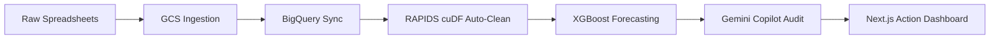
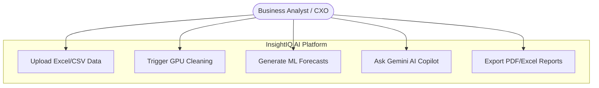
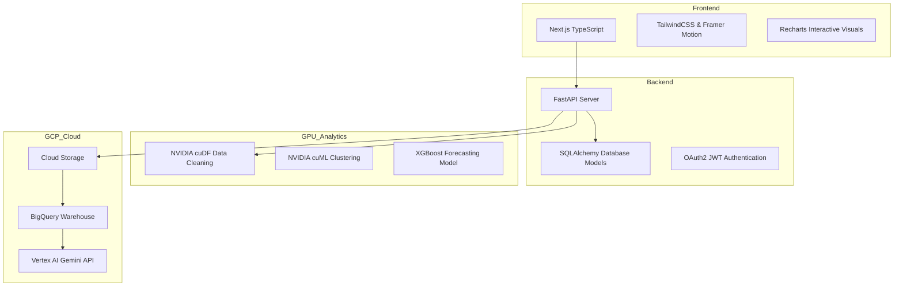

# Presentation Diagrams Code - InsightIQ AI

Use these Mermaid codes to generate professional diagrams for your pitch deck slides.

---

## 🔄 1. Process Flow Diagram

---

## 🎯 2. Use Case Diagram

---

## 🛠️ 3. Technology Stack Diagram

